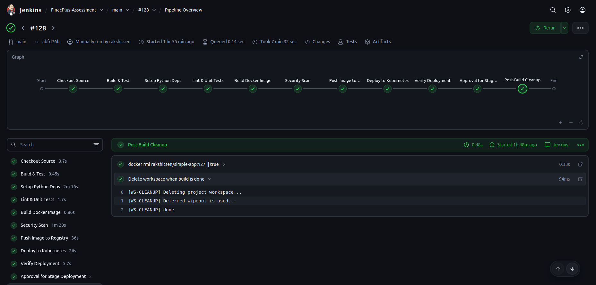
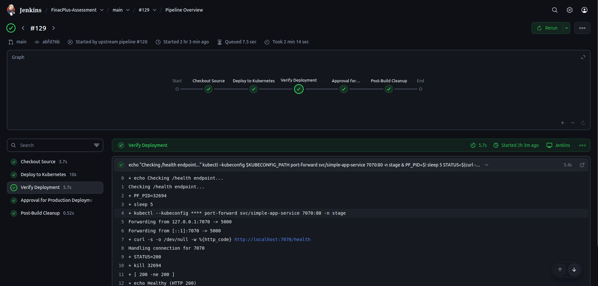
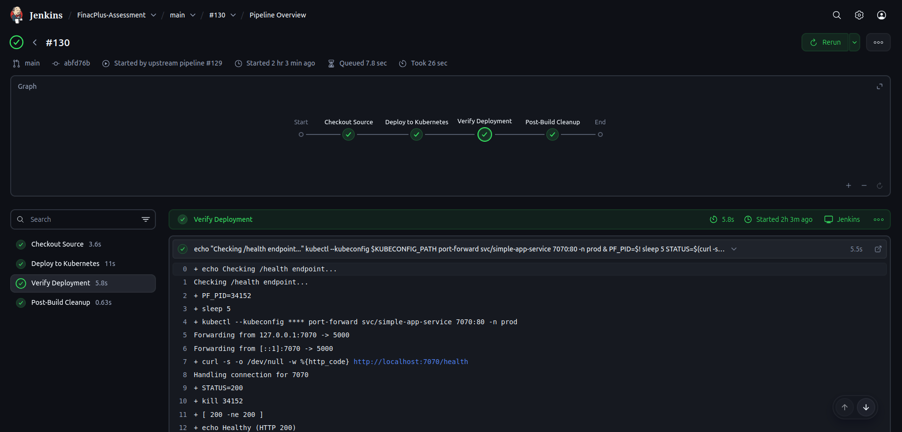
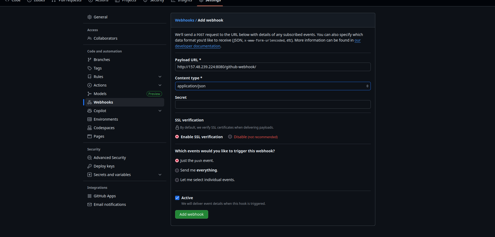

# 🌐 FinacPlus Assessment – Enterprise-Grade CI/CD Pipeline

> A complete **DevSecOps pipeline** built with **Jenkins, Docker, Kubernetes, and Trivy**, automating the software delivery lifecycle from code commit to production rollout.

---

## 🧩 Architecture Overview


**Flow:**

```
Developer → GitHub → Jenkins → Docker Hub → Kubernetes (dev → stage → prod)
                     │
                     ├── Trivy Scan (Security)
                     ├── Approval Gates (Manual)
                     └── Health Verification + Audit Logs
```

**Core Components:**

| Component                       | Role                                       |
| ------------------------------- | ------------------------------------------ |
| **GitHub**                      | Source control & Webhook trigger           |
| **Jenkins (Scripted Pipeline)** | CI/CD automation engine                    |
| **Docker & Docker Hub**         | Image build and registry                   |
| **Kubernetes (Kind)**           | Deployment environment                     |
| **Trivy**                       | Image vulnerability scanning               |
| **Prometheus + Grafana**        | Monitoring and observability (to be added) |

---

## ⚙️ Pipeline Summary

| Stage                       | Description                                    |
| --------------------------- | ---------------------------------------------- |
| **1. Checkout Source**      | Fetch latest code and Jenkinsfile from GitHub  |
| **2. Build & Unit Test**    | Python virtual env setup, linting, pytest      |
| **3. Build Docker Image**   | Build image `rakshitsen/simple-app:<build>`    |
| **4. Security Scan**        | Trivy vulnerability scan; JSON report archived |
| **5. Push to Registry**     | Push image and extract immutable digest        |
| **6. Deploy to Kubernetes** | Apply manifests; auto-create namespaces        |
| **7. Verify Deployment**    | `/health` endpoint validation                  |
| **8. Promotion Gates**      | Manual approvals for Stage/Prod                |
| **9. Post-Cleanup**         | Remove images, clean workspace                 |
| **10. Audit Summary**       | Logs deployment metadata and digest            |

**Dev**



**Stag**


**Prod**

---

## 🔐 Security Highlights

* **Immutable Artifact Promotion:** Same image digest deployed across all environments
* **Trivy Integration:** Identifies CVEs pre-deployment
* **Credential Security:** Managed via Jenkins Credentials store
* **Controlled Promotion:** Approval required for Stage and Prod
* **Rollback Support:** `ROLLBACK=true` parameter redeploys stable digest

---

## 🧰 Environment Setup

### Prerequisites

* Docker & Docker Hub account
* Jenkins with Docker and kubectl installed
* Kind or Minikube Kubernetes cluster
* GitHub repository connected with webhook

### Credentials to Configure in Jenkins

| ID                | Type                  | Used For               |
| ----------------- | --------------------- | ---------------------- |
| `Docker_cred`     | Username & Password   | Push to Docker Hub     |
| `KUBECONFIG_FILE` | Secret File           | Cluster authentication |
| `Git_cred`        | Personal Access Token | SCM operations         |

---

## 🔄 GitHub Webhook Integration

1. In Jenkins job config: enable **"GitHub hook trigger for GITScm polling."**
2. In GitHub repo:

   ```
   Settings → Webhooks → Add Webhook  
   Payload URL: http://<jenkins-host>:8080/github-webhook/
   Content type: application/json
   Trigger: Just the push event
   ```
3. Push a commit → Jenkins auto-triggers pipeline.



---

## 🧩 Jenkins Plugin Requirements

| Plugin                             | Purpose                             |
| ---------------------------------- | ----------------------------------- |
| **Pipeline (workflow-aggregator)** | Enables Jenkinsfile execution       |
| **Git & GitHub Integration**       | SCM connectivity + webhook triggers |
| **Credentials Binding**            | Secure credentials injection        |
| **Docker Pipeline**                | Image build and push                |
| **Blue Ocean (optional)**          | Visual UI for pipelines             |
| **Email Extension (optional)**     | Notifications                       |


---

## 🧾 Artifacts & Reporting

| Artifact                    | Purpose              |
| --------------------------- | -------------------- |
| `trivy-report-<build>.json` | Security scan result |
| `image-digest.env`          | Immutable SHA record |
| `pytest-report.xml`         | Unit test report     |
| `deploy-info.txt`           | Deployment summary   |

All are **fingerprinted and archived** in Jenkins for traceability.

---

## 📊 Monitoring Integration *(Planned)*

* **Prometheus metrics** via `/metrics` endpoint.
* **Grafana dashboard** for uptime, latency, and health visualization.
]*

---

## 💡 Key Learnings

* Build once, promote everywhere — guarantees immutability.
* Automate everything except trust (manual approval gates).
* Secure, auditable, rollback-ready delivery.
* Mirrors real-world DevOps workflows used in production pipelines.

---

## 👤 Author

**Rakshit Sen**  
DevOps & Cloud Engineering | 2025

---

## 📚 For Detailed Documentation

See [`pipeline-doc.md`](pipeline-doc.md) for:

* Stage-by-stage technical explanation
* Trivy integration details
* Shell safety, digest logic, and rollback notes

---