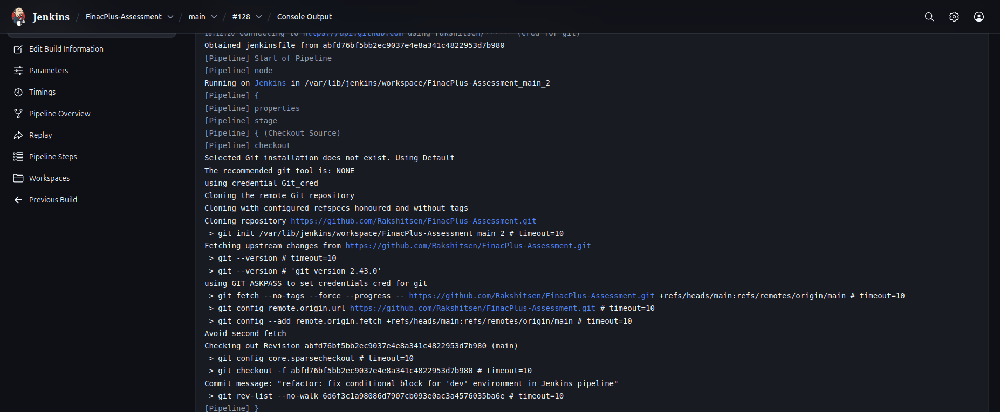
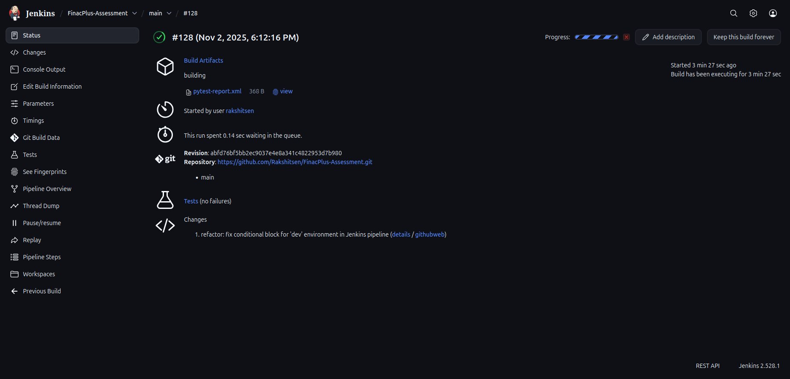
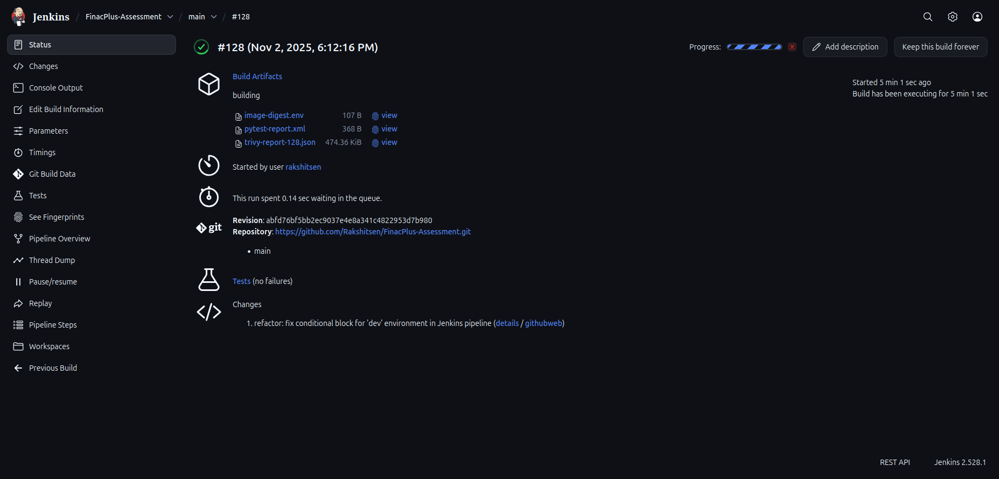
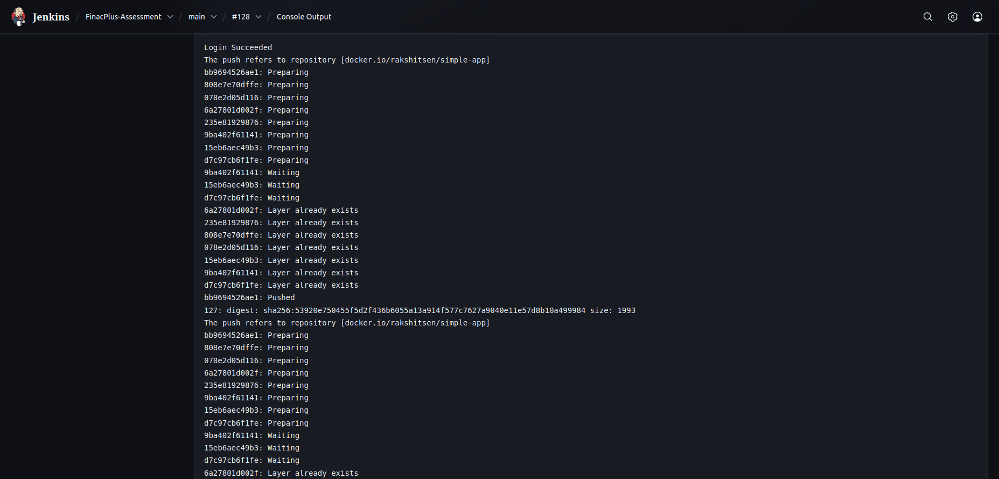
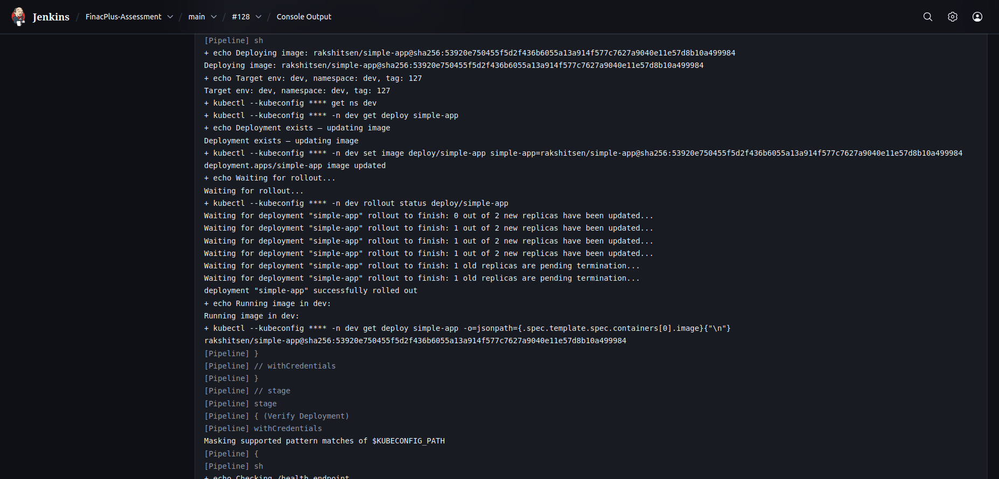
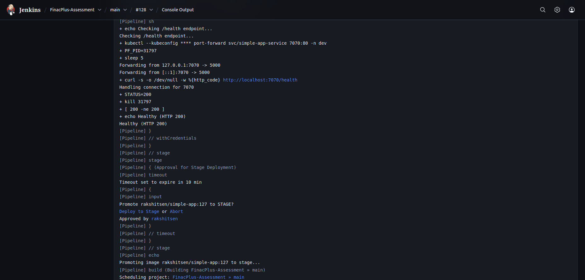
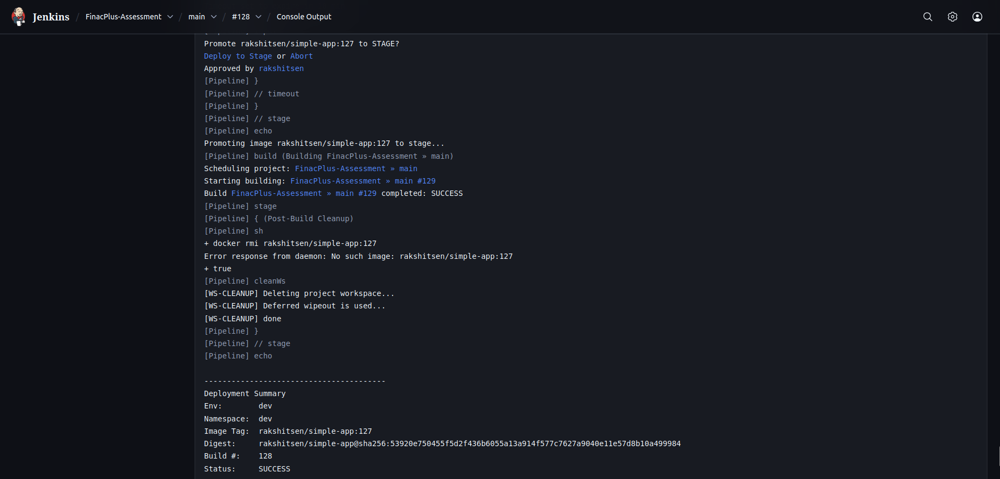
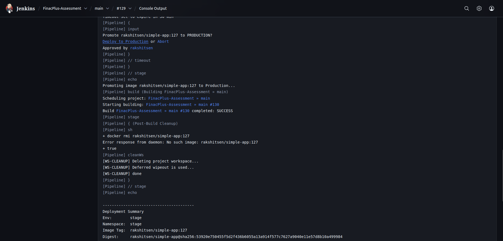
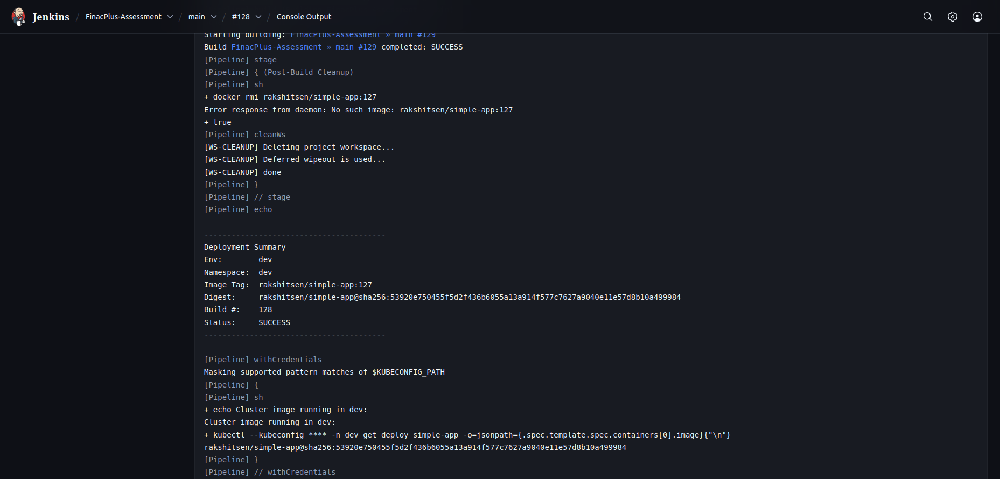
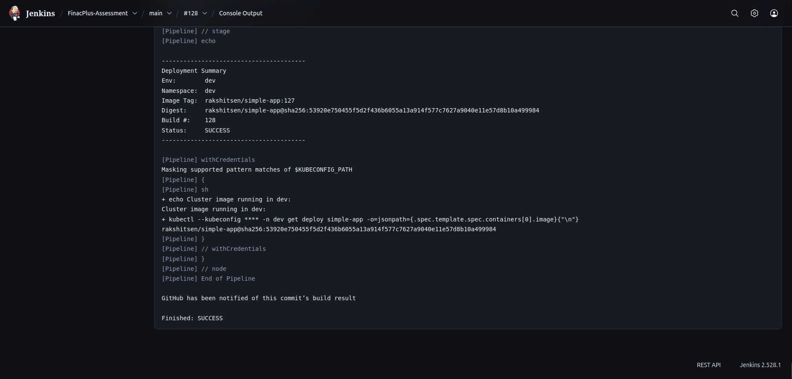

# 🚀 CI/CD Pipeline for Flask Application

**Platform:** Jenkins | Docker | Kubernetes (kind)
**Author:** Rakshit Sen
**Assessment:** FinacPlus DevOps Internship
**Documentation Format:** Technical Markdown (with Appendix for deep notes)

---

## 1. Objective

This project implements a **fully automated CI/CD pipeline** for a Python (Flask) application.
The pipeline ensures continuous integration, automated testing, security scanning, and continuous deployment to a Kubernetes cluster.

Key design goals:

* One Jenkinsfile for all environments: **dev → stage → prod**
* Immutable promotion: deploy **the same Docker image digest** across environments
* Security and audit built-in (Trivy scan, logs, digest records)
* Minimal human intervention (approvals only at promotion gates)

---

## 2. Architecture Overview

### Pipeline Components

| Component    | Tool/Service                     | Description                                  |
| ------------ | -------------------------------- | -------------------------------------------- |
| CI Engine    | Jenkins (Scripted Pipeline)      | Orchestrates all build and deployment stages |
| SCM          | GitHub                           | Source code + Jenkinsfile                    |
| Image Build  | Docker                           | Builds application container                 |
| Image Scan   | Trivy                            | Security vulnerability scanning              |
| Registry     | Docker Hub                       | Stores versioned images                      |
| Cluster      | Kubernetes (kind)                | Hosts dev, stage, prod workloads             |
| Deployment   | `kubectl`                        | Manages rollout and verification             |
| Notification | Jenkins Console (optional email) | Summarizes results per build                 |

---

### High-Level Flow Diagram (Text-Based)

```
┌────────────┐
│  Developer │
└──────┬─────┘
       │ Push Code
       ▼
┌──────────────┐
│   Jenkins CI │
└──────┬───────┘
       │ Checkout
       ▼
┌──────────────┐
│ Build & Test │
└──────┬───────┘
       │ Docker Build
       ▼
┌──────────────┐
│  Trivy Scan  │
└──────┬───────┘
       │ Push Image → Docker Hub
       ▼
┌──────────────┐
│ Deploy to K8s│
└──────┬───────┘
       │ Rollout + Health Check
       ▼
┌────────────────────┐
│ Approve & Promote  │
└────────────────────┘
```

---

## 3. Pipeline Flow Summary

| Phase | Stage                   | Description                                      |
| ----- | ----------------------- | ------------------------------------------------ |
| 1     | **Initialization**      | Define parameters and environment variables      |
| 2     | **Source Checkout**     | Pull latest code from GitHub                     |
| 3     | **Build & Unit Tests**  | Run Python dependency setup, linting, and tests  |
| 4     | **Docker Build & Scan** | Build container and run Trivy vulnerability scan |
| 5     | **Push to Registry**    | Push tagged image and record SHA digest          |
| 6     | **Deploy to K8s**       | Apply manifests and perform rolling update       |
| 7     | **Health Check**        | Verify `/health` endpoint                        |
| 8     | **Approval Gates**      | Manual promotion from dev→stage→prod             |
| 9     | **Cleanup**             | Remove images and temporary files                |
| 10    | **Audit Summary**       | Print deployment summary and verify digest       |

---

## 3.1 GitHub Webhook Integration (Triggering the Pipeline)

To achieve Continuous Integration, the pipeline is automatically triggered every time code is pushed to GitHub.

### How It Works
- GitHub sends an HTTP POST request to Jenkins whenever:
  - A commit is pushed to `main` (or any tracked branch)
  - A Pull Request is created or merged (optional)
- Jenkins receives the webhook payload and starts the build automatically.

### Setup Steps
1. In Jenkins:
   - Go to **Manage Jenkins → Configure System → GitHub**.
   - Add credentials (if private repo).
   - Under your job configuration, check **“GitHub hook trigger for GITScm polling”**.

2. In GitHub:
   - Navigate to your repository → **Settings → Webhooks → Add Webhook**.
   - Payload URL:  
     ```
     http://<your-jenkins-url>:8080/github-webhook/
     ```
   - Content type: `application/json`
   - Choose: **“Just the push event”** (or add PR events if needed).

3. Test by pushing a new commit:
   - The Jenkins job should trigger instantly.
   - Console will log:
     ```
     Received PUSH event from GitHub → Starting pipeline...
     ```

---

✅ **Result:**  
Every commit to GitHub automatically initiates the full CI/CD pipeline — no manual build trigger required.
This transforms Jenkins from a manual build server into a fully automated CI engine.


## 3.2 Jenkins Plugin Requirements

Before running this pipeline, make sure the following plugins are installed and up to date.

| Plugin                                  | Purpose                                                      | Minimum Version | Notes                                  |
| --------------------------------------- | ------------------------------------------------------------ | --------------- | -------------------------------------- |
| **Pipeline** (`workflow-aggregator`)    | Enables Jenkinsfile-based scripted and declarative pipelines | 2.6+            | Core requirement                       |
| **Git**                                 | Provides Git SCM integration                                 | 5.0+            | Needed for repository checkout         |
| **GitHub Integration**                  | Allows GitHub → Jenkins webhooks and build status reporting  | 1.37+           | Required for automatic triggers        |
| **Credentials Binding**                 | Securely injects Docker Hub and Kubeconfig credentials       | 1.27+           | Used by `withCredentials()`            |
| **Docker Pipeline**                     | Provides Docker build and registry steps                     | 1.28+           | Needed for image builds/push           |
| **JUnit**                               | Parses and displays test results from `pytest-report.xml`    | 1.55+           | Enables test reports in Jenkins UI     |
| **Blue Ocean** *(optional)*             | Provides modern UI for visualizing pipeline stages           | –               | For better stage visualization         |


**Installation Steps**

* Navigate to Manage Jenkins → Plugins → Available Plugins.

* Search each plugin name and click Install without restart.

* Once installed, verify under Installed Plugins.

* Restart Jenkins if prompted.

✅ **Result**:
All Jenkins core and security dependencies are satisfied, ensuring that the pipeline runs cleanly and integrates with GitHub, Docker Hub, and Kubernetes without manual intervention.


## 4. Stage-by-Stage Explanation

### 4.1 Checkout Source

* Jenkins pulls the latest code and Jenkinsfile from GitHub.
* No credentials stored in the Jenkinsfile; uses Jenkins SCM configuration.



---

### 4.2 Build & Test (Only for `dev`)

Runs only in the **development** environment.

* Verifies Python and Docker versions.
* Creates a virtual environment.
* Installs dependencies from `requirements.txt` and `requirements-dev.txt`.
* Lints code using `ruff` and runs unit tests via `pytest`.
* Archives test results (`pytest-report.xml`).



---

### 4.3 Build Docker Image

* Builds the Docker image tagged as `rakshitsen/simple-app:<build-number>`.
* Tags another version as `latest` for reference.
* Ensures consistent reproducible builds.


---

### 4.4 Security Scan (Trivy)

* Runs **Trivy** in container mode to scan for OS and dependency vulnerabilities.
* Generates:

  * Human-readable table in console.
  * JSON report file (`trivy-report-<build>.json`).
* Artifacts archived in Jenkins for later review.



---

### 4.5 Push Image to Docker Hub

* Logs in securely using Jenkins **Docker_cred**.
* Pushes both `<TAG>` and `latest` versions.
* Extracts the **immutable image digest (SHA256)** and stores it in `image-digest.env`.
* Digest is archived for promotion.

This ensures the **same binary image** is deployed across all environments.



---

### 4.6 Deploy to Kubernetes

* Reads digest from the file or falls back to tag.
* Checks if target namespace exists:

  ```bash
  kubectl get ns <namespace> || kubectl create ns <namespace>
  ```
* If deployment exists → updates image.
  If not → creates deployment from manifest.
* Waits for rollout completion.



---

### 4.7 Verify Deployment (Health Check)

* Temporarily port-forwards service to localhost.
* Checks `/health` endpoint; expects HTTP 200.
* Terminates port-forward process gracefully.



---

### 4.8 Approval Gates

Manual promotion stages for controlled rollout.

#### Dev → Stage

After a successful dev deployment:

* Jenkins waits for manual approval (10 min timeout).
* On approval, triggers the same job with:

  * `TARGET_ENV=stage`
  * Same `IMAGE_DIGEST`
  * `ROLLBACK=true` to skip rebuild




#### Stage → Prod

After successful stage validation:

* Waits up to 30 minutes for approval.
* Deploys using same digest into prod namespace.



---

### 4.9 Post-Build Cleanup

* Removes local images to free disk space.
* Cleans workspace safely using `cleanWs()`.


---

### 4.10 Audit & Summary

Runs regardless of pipeline success or failure (`finally` block).

Prints a clean audit:

```
----------------------------------------
Deployment Summary
Env:        stage
Namespace:  stage
Image Tag:  rakshitsen/simple-app:45
Digest:     sha256:abcdef...
Build #:    45
Status:     SUCCESS
----------------------------------------
```

Optionally, can send email reports (commented out).



---

## 5. Security & Reliability Features

| Feature                  | Description                                |
| ------------------------ | ------------------------------------------ |
| **Credential Masking**   | No passwords visible in logs               |
| **Trivy Integration**    | Catches vulnerabilities early              |
| **Immutable Deployment** | Uses image digest across envs              |
| **Strict Shell Flags**   | `set -euo pipefail` prevents silent errors |
| **Controlled Promotion** | Manual approval gates reduce risk          |
| **Namespace Isolation**  | Separate Kubernetes namespaces per env     |
| **Clean Rollback Logic** | ROLLBACK parameter for safe redeploys      |

---

## 6. Error Handling

* Each stage wrapped in `try/catch/finally`
* Tracks current stage in variable `currentStage`
* On failure:

  ```
  ━━━━━━━━━━━━━━━━━━━━━━━━━━━━━━━━━━━━━━━━━━━━━━━━━━━━━━━
  BUILD FAILED
  Stage: Deploy to Kubernetes
  Error: <error message>
  Build: #12
  Console: <Jenkins URL>
  ━━━━━━━━━━━━━━━━━━━━━━━━━━━━━━━━━━━━━━━━━━━━━━━━━━━━━━━
  ```
* Logs continue for debugging without exposing secrets.

---

## 7. Future Improvements

| Area                         | Suggestion                                                |
| ---------------------------- | --------------------------------------------------------- |
| **Branch-based Deployments** | Use multibranch pipelines to auto-deploy feature branches |
| **Helm / Kustomize**         | Replace raw manifests with templated charts               |
| **Slack Integration**        | Notify channel on approvals or failures                   |
| **Policy Enforcement**       | Gate promotions on Trivy or pytest pass thresholds        |
| **Automated Rollbacks**      | Detect failed rollout and revert image digest             |


---

## 8. Technical Notes Appendix

*(All your deeper explanations consolidated here for learning and interviews)*

### 🔹 Shell Safety Flags (`set -euo pipefail`)

* `-e` → exit immediately on error
* `-u` → treat unset vars as errors
* `-o pipefail` → fail on any command in a pipeline

Ensures no hidden or partial execution failures in CI/CD environments.

---

### 🔹 Why Use `printf "%s" "$PASS"`

* Prints secret exactly as is (no newline).
* Prevents token corruption during `docker login`.
* Safer than `echo`.

---

### 🔹 Jenkins `withEnv` and Escaping `$`

* `withEnv([...])` temporarily exports vars to shell.
* Groovy variables (`${VAR}`) expand early; shell ones (`$VAR`) need `\$` escape.
* `\$USER` means “let shell read this later.”

---

### 🔹 Redirection Explained

`>/dev/null 2>&1`
→ Discards both stdout and stderr.
Used to silently check for resource existence.

---

### 🔹 Why Use Image Digest

* Tags are mutable (`latest` can change).
* Digest (`sha256:...`) is immutable.
* Guarantees exact same artifact promoted between environments.

---

### 🔹 Promotion Logic

* **Build once** in dev.
* **Promote many** (stage, prod) using digest only — no rebuild.
* Implements “immutable artifact promotion.”

---

### 🔹 Namespace Creation Logic

```bash
kubectl get ns <ns> >/dev/null 2>&1 || kubectl create ns <ns>
```

If namespace exists → skip creation.
If not → create silently.

---

### 🔹 Post & Finally Difference

Declarative pipelines have `post { always { ... } }`,
but in scripted pipelines, `finally { ... }` achieves the same.

---

### 🔹 Artifact Fingerprinting

Jenkins fingerprints `image-digest.env` and `trivy-report.json`
for traceability between builds.

---

### 🔹 Rollback Mode

Setting `ROLLBACK=true` deploys existing digest
without rebuilding or pushing new images.

---

## 9. Conclusion

This Jenkinsfile and documentation demonstrate:

* End-to-end CI/CD automation for containerized workloads
* Secure, traceable, and repeatable deployments
* Industry-standard DevOps practices (testing, scanning, promotion, rollback)

It can serve as a foundation for production-grade pipelines using Helm, GitOps, or cloud-native registries.

---

🧠 **Maintained by:** Rakshit Sen
🗓️ **Version:** 1.0
📁 **File:** `FinacPlus-CICD-Pipeline.md`

---